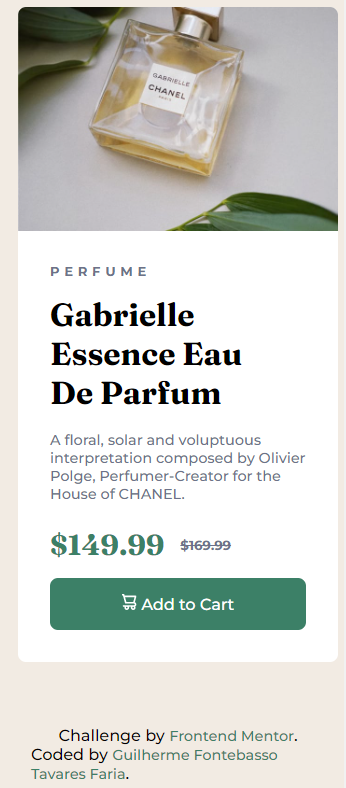

# Frontend Mentor - Product preview card component solution

This is my solution to the [Product preview card component challenge on Frontend Mentor](https://www.frontendmentor.io/challenges/product-preview-card-component-GO7UmttRfa).

## Table of contents

- [Frontend Mentor - Product preview card component solution](#frontend-mentor---product-preview-card-component-solution)
  - [Table of contents](#table-of-contents)
  - [Overview](#overview)
    - [The challenge](#the-challenge)
    - [Screenshot](#screenshot)
    - [Links](#links)
  - [My process](#my-process)
    - [Built with](#built-with)
    - [What I learned](#what-i-learned)
  - [Author](#author)

## Overview

### The challenge

Users should be able to:

- View the optimal layout depending on their device's screen size
- See hover and focus states for interactive elements

### Screenshot

### Links

- Github [Repository](https://github.com/GFTF0906/product-preview-card-component)
- Github [Pages](https://gftf0906.github.io/product-preview-card-component/)
- 
## My process

### Built with

- Semantic HTML5 markup
- CSS custom properties
- Flexbox

### What I learned

I learned how to work better with the width of an image in relation to the section it is in.

## Author

- Github - [Guilherme Fontebasso Tavares Faria](https://github.com/GFTF0906)
- Frontend Mentor - [@GFTF0906](https://www.frontendmentor.io/profile/GFTF0906)
- Twitter - [@echolovesjava](https://twitter.com/echolovesjava)
